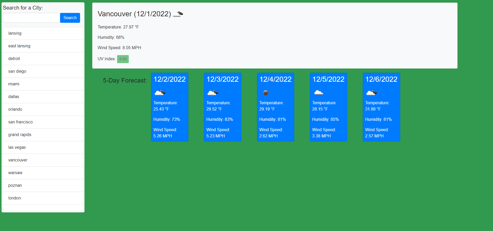

  # MSUBC_Module6_CH Weather App by Mateusz Zielinski
  Module Topic: Server-Side-APIs
  ## Description
  This program pulls data from a weather API based on a users search-input, then displays todays weather, as well as the forecast for the next 5 days. If the user closes the page, their previously selected location will be show up upon re-opening the page.
  
  
  ## License
  
  This application is not currently under any license agreement.
  ## Table of Contents
  - [License](#License)
  - [Usage](#Usage)
  - [Installation](#Installation)
  - [Testing](#Testing)
  - [Contributing](#Contributing)
  ## Usage
  - open index.html in a web browser
  - type in the name of a city into the search form, then click the search button
  - todays weather as well as the forecast for the next 5-days will be displayed
  - select previous searches by clicking on them in the search list on the left-hand side
  ## Installation
  - open gitbash
  - navigate to the desired parent folder 
  - type into gitbash 'git clone https://github.com/IMadeThisJustToPostThis/MSUBC_Module6_CH-Weather-App.git'
  ## Testing
  no tests, simply bug tested manually
  ## Contributing
  contibute however you want i don't care
  ## Questions
  Github:<https://github.com/IMadeThisJustToPostThis>
  
  Email: zielinm2@mail.lcc.edu